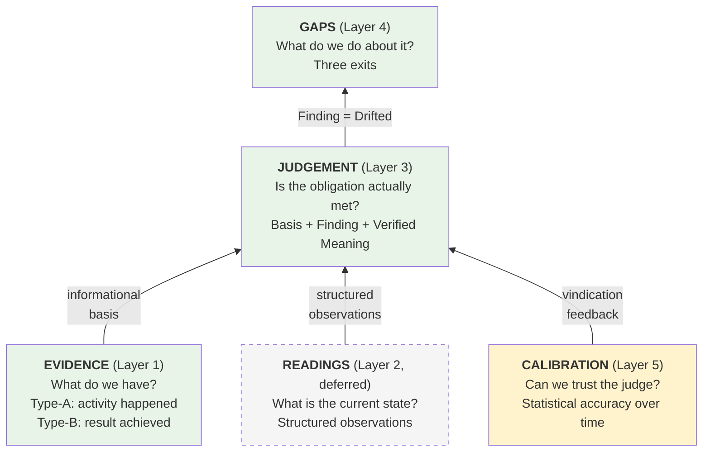

# Evidence, Judgement, and Calibration — the Five Layers

How the L4 Evidence tier handles the gap between legible compliance and load-bearing reality. Five layers, each doing different work.

---

## The five layers

| Layer | What it is | What it answers | Schema entity |
|-------|-----------|-----------------|---------------|
| **Evidence** | Information — documents, logs, certificates, sensor readings, test results, records | *What do we have? What does it tell us?* | Evidence |
| **Readings** | Structured observations — does the predicate hold right now? | *What is the current state?* | Readings (deferred) |
| **Judgement** | A calibrated person's substantive assessment of whether the obligation is actually met | *Is it any good? Is this risk assessment suitable and sufficient?* | Calibrations |
| **Gaps** | The governed gap — when judgement finds drift, a named owner decides the response | *What do we do about it?* | Gaps |
| **Calibration** | The demonstrated accuracy of the judge over time — the proportion of their stated confidences that reality confirmed | *Can we trust this person's judgement?* | Personnel.calibration_score + vindication loop |

The layers are functionally distinct: evidence is the **informational basis**, readings are **structured observations**, judgement is the **operation**, gaps are the **decisions**, calibration is the **quality assurance of the operator**.

---

## Layer 1: Evidence (information)

Information that changes what a rational person should believe about whether an obligation is met (see [DEFINITION-OF-EVIDENCE.md](DEFINITION-OF-EVIDENCE.md)). Documents, logs, certificates, test results, sensor readings, inspection records.

Evidence is the informational basis for everything downstream — judgement uses it, readings formalise parts of it, gaps respond to what it reveals. But evidence is not uniformly passive. It splits into two classes with very different discriminating power:

**Type-A evidence (activity)** proves an activity happened. A training record, a filed risk assessment, a permit issued on time. These answer "did it happen?" but not "is it any good?" They would exist whether or not the obligation is actually met — the same training record regardless of whether the person is competent. Likelihood ratio near 1. Low discriminating power. This is the legible layer.

**Type-B evidence (outcome)** proves a result. A functional test showing the control failed 3 of 12 times. An emissions sensor reading showing exceedance. A backup log showing failure. These answer "what actually happened when tested?" and they **look different depending on whether the obligation is met or not**. High likelihood ratio. High discriminating power. Type-B evidence does substantive work on its own — it carries signal about compliance without needing a person's judgement.

The boundary between evidence and judgement is therefore not sharp. Type-A evidence sits cleanly in Layer 1 — it is input to judgement. Type-B evidence sits on the boundary — it does some of judgement's work (discriminating between compliant and non-compliant) while remaining an artifact. A sensor reading that shows exceedance IS evidence that the obligation isn't met. A functional test that shows failure IS evidence that the control doesn't work. These don't need a calibrated person to interpret them — the data speaks.

Where judgement becomes essential is where evidence — even Type-B evidence — doesn't fully discriminate. "The control failed 3 of 12 times" is clear evidence of a problem, but "is this risk assessment adequate to the hazard?" requires a person to read the assessment, look at the workplace, and exercise professional judgement. The more the obligation encodes human judgement terms (adequate, proportionate, competent, sufficient), the less evidence alone can settle the question, and the more Layer 3 (Judgement) must do.

**Schema**: the Evidence entity. `evidence_class`: Activity (Type-A) or Outcome (Type-B). Lifecycle: Current / Expired / Superseded.

---

## Layer 2: Readings (structured observations)

Raw, structured observations of the current state — does the predicate hold right now? A sensor reading, a functional test result, an automated check, a worker attestation. Where Evidence is a stored artifact, a Reading is a point-in-time observation with a value (true/false/measure) and a source.

Readings sit between Evidence and Judgement because they are more structured than artifacts but less interpreted than judgements. A sensor reading that shows exceedance is a Reading. The filed report about that reading is Evidence. The person's assessment of what the exceedance means for compliance is Judgement.

Readings are where fractalaw and automated systems do their work — scanning control properties, taking measurements, checking predicates. They are the "is" in the "ought vs is" reconciliation loop.

**Schema**: the Readings entity (deferred). Until built, the Calibrations.`basis` field captures what was observed. Readings will formalise observations as structured data with source, timestamp, and value. When the Readings entity is built, it will be the primary carrier of Type-B (outcome) data — the structured, discriminating observations that do substantive evidential work.

---

## Layer 3: Judgement (the exercise of calibrated decisioning)

A named person looks at the evidence, looks at reality, and states their confidence that the obligation is actually met. This is a first-order assessment — not a meta-check on whether a gauge has drifted, but a substantive adequacy judgement about the thing itself.

The output is an **explicitly stated confidence**: not "High/Medium/Low" (a categorical bucket that collapses to a tick), but a range estimate with boundaries. "I'm roughly 75-85% confident this risk assessment covers the significant hazards, but I haven't assessed the new process line and the exposure data is from 2024." The range and the boundaries of the person's knowledge are the signal — what they know, what they don't, and how certain they are.

This is where the Value of Information framework targets scarce human attention. Judgement goes where uncertainty x consequence is highest — remote, stale, high blast-radius controls where the legible evidence is most likely to be hollow. The EVI calculation (see [VALUE-OF-INFORMATION.md](VALUE-OF-INFORMATION.md)) is the scheduling engine: it directs the calibrated person to the place where their judgement reduces the most expected loss.

The judgement operation uses the legible evidence (Layer 1) as input. It does not replace or override the evidence — it interprets it. The risk assessment document (evidence) is the material; the conclusion that the risk assessment is suitable and sufficient (judgement) is the assessment. Both are recorded.

When judgement finds that the obligation is not met — the gauge has drifted, the control is inadequate, the procedure no longer matches the hazard — the finding creates a Gap with three exits: correct the work, amend the constraint, or protect competent adaptation.

**Schema**: the Calibrations entity. Fields: `calibrator_id` (the named person), `basis` (what they observed and the evidence they used), `finding` (Still True / Drifted / Retired — the operational outcome), `verified_meaning` (what "verified" means right now). The `basis` field carries the reasoning and uncertainty; the `finding` drives downstream action.

---

## Layer 4: Gaps (the governed gap)

When judgement finds drift — the control is inadequate, the procedure no longer matches the hazard, the obligation is not met — the finding creates a **Gap**. The Gap is a first-class entity because it carries the reconciliation decision: what does the organisation do about the divergence between what it committed to and what is actually true?

The Gap has three exits, and the choice of exit is itself a judgement made by a named owner:

- **Correct the work**: the practice was wrong. Creates an Action to fix/improve/create a control.
- **Amend the constraint**: the commitment was wrong. The obligation or control needs updating — the gap is in the standard, not the practice.
- **Protect competent adaptation**: the gap is healthy. The person adapted sensibly to conditions the procedure didn't anticipate. The deviation is resilience, not drift, and must not be "corrected" away.

The third exit is critical. Without it, the system mechanically "corrects" every deviation — which kills the adaptive capacity that Safety-II identifies as protective. A system that only has "correct the work" structurally assumes every gap is a deficiency. Reality is more nuanced: some gaps are failures, some are the standard being wrong, and some are people being good at their jobs.

A Calibration with Finding = Still True produces **no Gap**. The loop closes. A Calibration with Finding = Drifted produces a Gap. A Calibration with Finding = Retired produces a decommission review.

**Schema**: the Gaps entity. Fields: `calibration_id` (which calibration found this), `gap_type` (Drift / Non-Conformance / Deviation / Near Miss), `exit_decision` (Correct Work / Amend Constraint / Protect Adaptation), `reason` (append-only audit trail), `status` (Open / Resolved / Accepted), `owner_id`, `decision_date`.

---

## Layer 5: Calibration (the recalibration of the gauge)

The gauge being calibrated is the **person**. Calibration is the demonstration, over a population of their judgements, that their stated confidences track reality. If a person states 80% confidence across 20 judgements and 16 of them are subsequently confirmed, they are well-calibrated. If only 10 are confirmed, they are over-confident — their gauge drifts high.

This is Hubbard's calibrated probability assessment applied to compliance. It is measurable, trainable, and — critically — it is a property accumulated over time, not something verifiable on any single judgement. You cannot tell from one assessment whether the person's confidence was well-placed. You can tell from fifty.

The mechanism in the schema: when an Incident later vindicates or contradicts a prior Calibration finding, the `vindication_status` is set (Supported / Contradicted), and the calibrator's `calibration_score` on Personnel is updated. Over time, this produces a statistical track record — the demonstrated accuracy that makes a person's future judgements defensible.

**The firewall**: calibration score is quarantined from appraisal, HR, and discipline. It measures predictive accuracy, not job performance. The moment it becomes career-relevant, people manage the score instead of being honest — Goodhart's Law applied to the judge. The score exists to improve the system's self-knowledge, not to rank people.

**Schema**: Personnel.`calibration_score` (0-100, Hubbard-style), Personnel.`last_cal_test`, Personnel.`calibrated_domains`. Feedback loop: Calibrations.`vindication_status` → Personnel.`calibration_score`.

---

## How the layers relate

**Evidence and Readings feed Judgement.** The calibrated person uses artifacts and structured observations — inspection records, sensor data, test results, filed documents — as the informational basis for their assessment. Without evidence, the judgement has no foundation. With only evidence, the substance goes unassessed — unless the evidence is Type-B and discriminates on its own.

**Judgement produces Findings.** Finding = Still True closes the loop. Finding = Drifted creates a Gap. The judgement is the substantive assessment that answers the question the regulator actually asks: "is this suitable and sufficient?"

**Gaps produce Decisions.** The three-exit gap forces the organisation to respond to drift — not just record it. Correct the work, amend the constraint, or protect the adaptation. Without the Gap entity, every finding of drift defaults to "correct the work" — which suppresses healthy adaptation.

**Calibration validates the Judge.** A person with a demonstrated track record of accuracy (calibration score = 85) provides higher Value of Imperfect Information than a person with unknown accuracy, even if the second person spends more time. The calibration score encodes the quality of the information source — the reliability of the judge as an instrument.

---

## What each layer is not

**Evidence is not proof of compliance.** A filed risk assessment proves a document exists. It does not prove the risk assessment is adequate to the hazard. Type-A evidence alone — however complete — is the legible column with the load-bearing column empty. But Type-B evidence (outcome data, test results) can do substantive work — it discriminates between compliant and non-compliant without needing human judgement.

**Judgement is not affirming or rejecting the evidence.** The judge does not come along and tick "confirmed" on an artifact. They exercise a separate assessment: given what the evidence says AND given what I can observe, is this obligation actually met? The output is a finding with reasoning, not a stamp.

**Calibration is not a per-instance check.** You cannot calibrate a person on a single judgement. Calibration is statistical — it emerges from the pattern of accuracy across a population of judgements over time. The vindication loop (incidents confirming or contradicting prior findings) is the feedback mechanism that makes calibration measurable rather than assumed.

---

## The connection to the evidence demand gradient

The [evidence demand gradient](LEGIBLE-vs-LOAD-BEARING.md) maps where each layer does its work:

| Position on the gradient | Layers active | Why |
|---|---|---|
| **Bottom-left** (direct, fresh, low VoI) | Evidence (Layer 1) may suffice — especially Type-B | The obligation is observable, recently verified. Type-B evidence (test results, sensor data) discriminates on its own. Low VoI for additional judgement. |
| **The diagonal** | Evidence + Readings + periodic Judgement | Artifacts exist but their reliability as proxies degrades with distance and staleness. Readings add structured observation. Judgement checks the substance. Gaps surface when findings show drift. |
| **Top-right** (remote, stale, high VoI) | All five layers active | The obligation is far from view, rarely tested, the cost of being wrong is high. Judgement is essential — evidence alone doesn't discriminate. Gaps drive three-exit decisions. Calibration quality determines how much to trust the finding. |

The EVI calculation (`priority = blast_radius x uncertainty`) targets judgement (Layer 3) at the top-right. The calibration score (Layer 5) determines how much uncertainty each person's judgement actually reduces. Gaps (Layer 4) ensure that findings of drift produce structured decisions, not just records. Together the five layers answer: **what do we know, what don't we know, what should we do about it, and how much should we trust the answer?**

---

## References

- Hubbard (2007) *How to Measure Anything* — calibrated probability assessment, EVI, the Measurement Inversion
- Hopkins (2008) *Failure to Learn* — Type-A vs Type-B indicators
- Rae & Provan (2018) "Safety work versus the safety of work" — the operationalisation paradox
- SMS Form Dialectic — Round 2 (the Calibrated Circle), Round 3 (Signal not Score)
- `EVIDENCE-SCHEMA.md` — canonical L4 entity model
- `LEGIBLE-vs-LOAD-BEARING.md` — the operationalisation paradox, the evidence demand gradient
- `VALUE-OF-INFORMATION.md` — EVI, the discriminating test, VoI in the calibration regime
