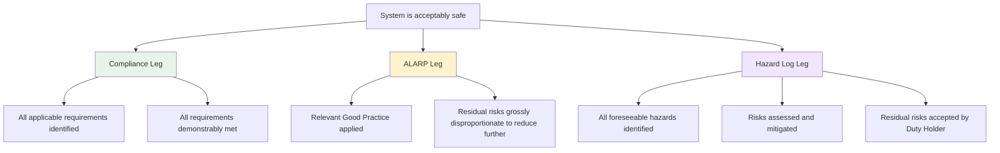
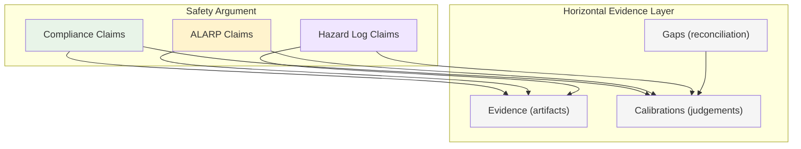

# Evidence and Safety Argument

How the L4 Evidence tier connects to safety cases — and why the evidence layer should be horizontal (serving compliance, ALARP, and hazard log) rather than vertical (sitting only within a compliance framework).

---

## The safety case structure

A safety case is a structured argument, supported by evidence, that a system is acceptably safe for a given application in a given operating environment (Def Stan 00-56). It uses the **Claims-Arguments-Evidence (CAE)** triad:

- **Claims** (Goals in GSN): assertions about safety properties. "The system is acceptably safe."
- **Arguments** (Strategies in GSN): the inferential reasoning connecting a claim to its supporting sub-claims or evidence. "Safe because hazards identified, controls in place, and risks ALARP."
- **Evidence** (Solutions in GSN): concrete artefacts that ground the argument in verifiable fact. Test results, analysis reports, compliance records, hazard log extracts.

The typical top-level safety argument decomposes along **three evidential legs**:

---

## The three legs

### 1. Compliance leg

**Claim**: all applicable regulatory and standards requirements have been identified and met.

**Evidence includes**: regulatory mapping (which laws and standards apply), compliance assessments against each requirement, design review records, test reports confirming standards conformance, certificates or approvals from notified bodies.

**What this IS in a GRC system**: the core of what compliance platforms do — track obligations, assign owners, record status. The Legal Register (L1), Assessments (L2), and Evidence (L4) in SertantAI directly serve this leg.

**What a safety argument needs that a GRC system doesn't normally provide**:

| Property                          | GRC provides                     | Safety argument needs                                                                                                       |
| --------------------------------- | -------------------------------- | --------------------------------------------------------------------------------------------------------------------------- |
| **Obligation tracking**           | Which requirements apply, status | Same                                                                                                                        |
| **Traceability to safety claims** | Not usually                      | Each compliance record linked to specific safety goals via explicit arguments                                               |
| **Argument for completeness**     | Records what was identified      | Argues the *set* of applicable requirements is complete — nothing missed                                                    |
| **Confidence characterisation**   | Pass/fail                        | How was compliance assessed? Self-declaration, independent audit, formal verification, validated by operational experience? |
| **Configuration binding**         | Often at organisational level    | Bound to a specific system configuration, operating context, and assumptions                                                |
| **Sufficiency argument**          | Not usually                      | Compliance with these requirements is sufficient (not merely necessary) for this safety claim                               |

### 2. ALARP leg

**Claim**: risks have been reduced to As Low As Reasonably Practicable — further reduction would cost grossly disproportionate to the benefit gained.

**Evidence includes**:

- **Relevant Good Practice (RGP)**: demonstrating that recognised standards and industry good practice have been applied. ONR guidance: ALARP is achieved through applying established RGP; only where these are insufficient is further analysis needed.
- **Cost-Benefit Analysis (CBA)**: for risks in the tolerable region, comparing the cost of additional measures against the safety benefit. HSE guidance: a measure must cost 10x or more its calculated safety benefit before it can be set aside.
- **Engineering judgement**: documented expert reasoning where quantitative analysis is impractical. Must be structured, recorded, defensible.
- **Optioneering studies**: systematic evaluation of alternatives showing the chosen approach is the best reasonably practicable.
- **Comparison with good practice in other sectors**: where no directly applicable standard exists.

ALARP is inherently a judgement — about proportionality — even when supported by quantitative evidence. This is the **load-bearing** part of a safety case (in our terminology). It resists being ticked. The evidence quality properties from [DEFINITION-OF-EVIDENCE.md](DEFINITION-OF-EVIDENCE.md) apply directly: does this evidence *discriminate* between "risk is ALARP" and "risk is not ALARP"?

### 3. Hazard Log leg

**Claim**: all foreseeable hazards have been systematically identified, assessed, and controlled.

**Evidence includes**:

- **Hazard identification**: systematic methods (HAZID, HAZOP, FMEA, FTA, STPA) applied, scope covers the full system and operational envelope
- **Risk assessment**: each hazard assessed for severity and likelihood against defined criteria
- **Mitigation tracking**: for each unacceptable risk, mitigations identified, assigned, implemented, verified
- **Closure**: hazards closed only when Duty Holder confirms ALARP
- **Residual risk acceptance**: open risks documented with ownership and timescales

The hazard log is essentially a **control register with lifecycle tracking** — not unlike the Controls (L3) + Calibrations (L4) + Gaps (L4) chain in SertantAI. A hazard log entry tracks a hazard → its controls/mitigations → evidence that mitigations work → residual risk status. A Controls table tracks a control → calibration of whether it still works → gap if it's drifted → action to fix.

---

## The horizontal evidence layer

### The insight

A single piece of evidence can serve all three legs simultaneously:

- A **test report** demonstrating compliance with a standard (compliance leg) also provides evidence that good practice has been applied (ALARP leg) and that a specific hazard mitigation is effective (hazard log leg).
- A **design analysis** may simultaneously satisfy a regulatory requirement, demonstrate risk reduction, and close a hazard log action.
- A **calibration finding** that a control is "Still True" serves as compliance evidence (the obligation is met), ALARP evidence (the risk reduction measure is operating), and hazard log evidence (the mitigation is effective).

This means the evidence layer should not be *vertical* (sitting within a compliance framework, serving only compliance) but **horizontal** (sitting beneath all three argument legs, with each evidence item linked to whichever claims it supports).

### What this requires from the evidence schema

For the evidence layer to serve all three legs, each evidence item needs properties beyond what a pure compliance system provides:

| Property                        | In L4 schema?                       | Needed for horizontal                                                         | Status                                                   |
| ------------------------------- | ----------------------------------- | ----------------------------------------------------------------------------- | -------------------------------------------------------- |
| **Control/obligation link**     | Yes (control_id, assessment_id)     | Yes                                                                           | Done                                                     |
| **Argument leg(s)**             | Yes (`argument_legs` enum[])        | Which legs this artefact/judgement serves (compliance, ALARP, hazard log)      | Done — on both Artefacts and Judgements                  |
| **Claim traceability**          | No                                  | Which specific safety claim(s) this evidence supports                         | Outside L4 — link to Claims entity or external safety case tool |
| **Confidence characterisation** | Yes (judgement_method + calibrator quality on Personnel) | Method of assessment                                              | Done — `judgement_method` + `calibration_score`          |
| **Configuration binding**       | Yes (`configuration_ref` text)      | System version, configuration, operating context                              | Done — on both Artefacts and Judgements                  |
| **Artefact_Class (Type-A/B)**   | Yes (`artefact_class`)              | Discriminating evidence more valuable to all three legs                       | Done                                                     |
| **Artefact↔Judgement join**     | Yes (`judgement_artefacts`)          | Traceable chain: claim → judgement → artefacts relied on                     | Done — surfaced in `:full_hubbard` / `:safety_argument`  |
| **Completeness argument**       | No                                  | Argument that the evidence set is sufficient for the claim                    | Outside L4 — belongs in argument structure               |

### What can be modelled vs what can't

**Can be modelled in the evidence layer**:

- **Evidence serving multiple legs**: an `argument_legs` multi-select field (Compliance / ALARP / Hazard Log) on each evidence and calibration record. One record, multiple uses — no duplication.
- **Hazard log entries as Controls**: hazard mitigations map directly to L3 Controls. A hazard log is a control register with severity/likelihood classification. The Controls template already has the right structure.
- **ALARP evidence as Calibrations**: an ALARP judgement ("this risk is ALARP because...") is structurally identical to a calibration ("this control is still true because..."). Both are named-person judgements with basis, finding, and reasoning.
- **Configuration binding**: a `configuration_ref` field on evidence records, linking to a system version or context.

**Cannot be modelled in the evidence layer** (belongs in the argument layer above):

- **Argument structure**: the GSN graph connecting claims to evidence via strategies. This is a separate concern — the evidence layer provides the *solutions* (leaves) of the argument tree, not the tree itself.
- **Completeness argument**: the case that the set of evidence is sufficient. This is a meta-argument about the evidence, not a property of individual evidence items.
- **Sufficiency judgement**: whether compliance with a set of requirements is sufficient for a safety claim. This is an argument, not evidence.

---

## Commonality and differences

### What compliance assessment and safety argument share

| Concern                   | Compliance assessment                                        | Safety argument                                                                     |
| ------------------------- | ------------------------------------------------------------ | ----------------------------------------------------------------------------------- |
| Obligation identification | Legal Register — which laws apply                            | Compliance leg — which requirements apply                                           |
| Control mapping           | Control Mappings — which controls satisfy which obligations  | Hazard log — which mitigations address which hazards                                |
| Evidence of operation     | Evidence + Calibrations — proof that controls work           | All three legs — evidence that requirements met, risks ALARP, mitigations effective |
| Gap detection             | Gaps — drift identified, three exits                         | Hazard log — open actions, residual risk                                            |
| Judgement records         | Calibrations with basis and finding                          | ALARP judgements with reasoning and proportionality                                 |
| Proportionality           | Value of Information — evidence effort proportionate to risk | ALARP — risk reduction proportionate to cost                                        |

### Where they differ

| Concern           | Compliance assessment                | Safety argument                                             |
| ----------------- | ------------------------------------ | ----------------------------------------------------------- |
| **Purpose**       | Surface uncertainty about whether obligations are met, take decisions, improve | Argue the system is acceptably safe |
| **Structure**     | Calibration regime — control → calibration → gap → exit | Hierarchical — claims → arguments → evidence |
| **Completeness**  | Track what was identified + detect absent gauges | Argue the identification is complete |
| **Confidence**    | Calibrator quality (Hubbard-style, on the person) | Characterised by method (self-declared → formally verified) |
| **Configuration** | Organisation-level | System-version-specific |
| **Audience**      | Internal compliance team + regulator | Safety case assessor (DSA, ONR, ORR, CAA) |
| **Lifecycle**     | Continuous calibration regime (drift_interval-driven) | Through-life — evolves with the system |

Both serve uncertainty reduction — but at different scopes. Compliance assessment asks "what don't we know about whether this obligation is met?" and uses that to drive calibration, decisions, and actions. A safety argument asks "is the system acceptably safe?" and uses compliance evidence (among other sources) as input to a structured case. The compliance system produces evidence; the safety argument *consumes* it as part of a larger structure.

### The key difference: argument structure

A compliance system surfaces uncertainty and drives action — calibration findings, gap detection, three-exit decisions. But it does not construct a hierarchical *argument* that the overall system is safe. A safety case does: "The system is safe *because* requirements are met *and* this is sufficient *because* the requirements cover all relevant hazards *and* the evidence demonstrates actual compliance not just paperwork."

The argument structure is the value-add of the safety case. It forces the question: *is this enough?* A compliance system asks "what's drifted?" — which is powerful but local. A safety case asks "taken together, do these controls and this evidence make the system acceptably safe?" — which is global. Both are needed. The evidence layer serves both.

---

## Cross-sector patterns

The three-legged pattern appears across UK safety-critical sectors with different names:

| Sector       | Standard                | Compliance leg                               | ALARP/risk leg           | Hazard leg            |
| ------------ | ----------------------- | -------------------------------------------- | ------------------------ | --------------------- |
| **Defence**  | Def Stan 00-56, JSP 815 | Applicable standards met                     | ALARP demonstration      | Hazard Log            |
| **Nuclear**  | ONR SAPs                | Relevant Good Practice applied               | ALARP and BAT            | Fault assessment, PSA |
| **Rail**     | CSM-RA, Yellow Book     | Codes of Practice, Reference Systems         | Explicit Risk Estimation | Hazard Record         |
| **Aviation** | ARP4754A, ARP4761       | Airworthiness requirements (DO-178C, DO-254) | Acceptable risk levels   | FHA, PSSA, SSA        |

The evidence layer is the same underneath all of them. What changes is the argument structure on top.

---

## What this means for SertantAI

### Near-term

The current L4 entities (Evidence, Calibrations, Gaps) already serve the compliance leg. To make them horizontal-ready:

1. **Add `argument_legs`** (multi-select: Compliance / ALARP / Hazard Log) to Evidence and Calibrations. Most records will be Compliance-only for now. The field exists for when a customer needs safety cases.
2. **Add `configuration_ref`** (text) to Evidence and Calibrations. For compliance-only use, this is "current." For safety cases, it binds evidence to a system version.
3. **Recognise that Controls ARE hazard mitigations.** The L3 Controls ontology (Properties/Methods/Events/Distance) is already a hazard log structure. A customer building a safety case can use Controls as their hazard mitigation register.
4. **Recognise that Calibrations ARE ALARP judgements.** "This control is still true" and "this risk is ALARP" are the same structure: named person, basis, finding, reasoning. The calibration record serves both.

### Longer-term

The argument structure (GSN tree connecting claims to evidence) lives above the evidence layer — in a safety case tool, in SertantAI's own argument module, or in a graph store. The evidence layer provides the leaves. The argument layer provides the tree. They are separate concerns, connected by traceability links.

fractalaw's role: compute coverage (which claims have sufficient evidence), detect gaps (claims with insufficient or stale evidence), and emit signals. This is the same role it plays for compliance — the mechanism is reusable across all three legs.

---

## References

- Def Stan 00-56 Issue 7 (2017) — Safety Management Requirements for Defence Systems
- JSP 815 V1.2 (2024) — Defence Safety Management System Framework
- ONR SAPs (2014 Rev 1) — Safety Assessment Principles for Nuclear Facilities
- ASEMS Online (MOD) — Safety Case guidance, GSN, Claim Trees
- CSM-RA (EU 402/2013, ORR guidance) — Common Safety Method for Risk Evaluation and Assessment
- ARP4754A — Guidelines for Development of Civil Aircraft and Systems
- ARP4761 — Guidelines and Methods for Conducting the Safety Assessment Process
- GSN Community Standard v3 (2021) — Goal Structuring Notation
- Haddon-Cave (2009) — Nimrod Review: SHAPED, LIPS, "shelfware"
- Kelly & Weaver (2004) — "The Goal Structuring Notation: A Safety Argument Notation"
- `DEFINITION-OF-EVIDENCE.md` — what evidence is
- `VALUE-OF-INFORMATION.md` — when evidence is worth collecting
- `LEGIBLE-vs-LOAD-BEARING.md` — the operationalisation paradox
- `EVIDENCE-SCHEMA.md` — canonical L4 entity model
