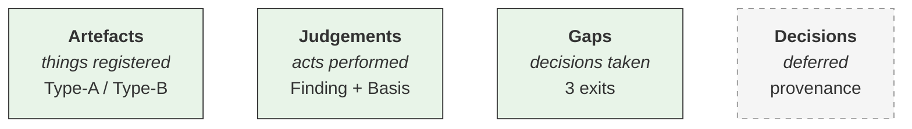
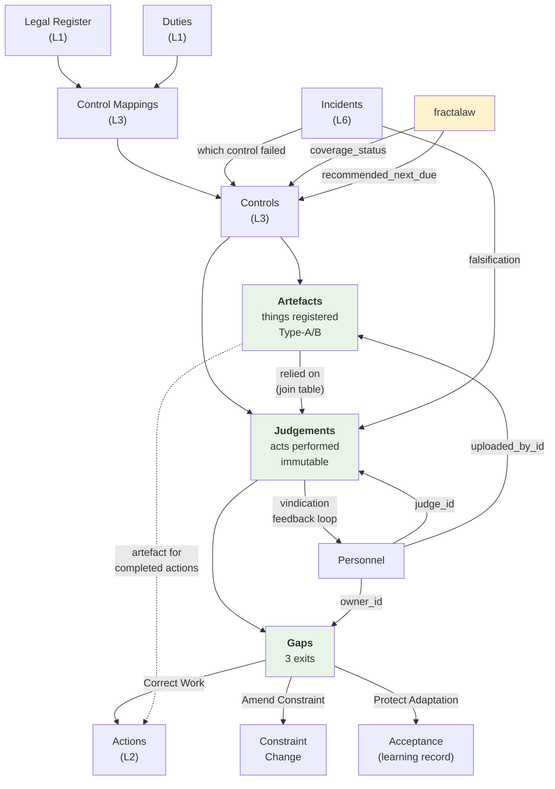

# L4 Evidence — Canonical Schema

The provider-agnostic entity model for L4 Evidence. This schema is the source of truth. Baserow templates, Ash/Ecto resources, and graph projections are derived from it.

**Design principle**: schema-first, then project. Previous layers (L1–L3) were designed for Baserow and will eventually have their canonical schemas extracted. L4 reverses this — no provider debt.

---

## Entity overview



Green = build now. Dashed grey = deferred (seam visible).

| Entity | Status | Purpose |
|--------|--------|---------|
| **Artefacts** | Build now | Things registered — documents, logs, certificates, test results, sensor readings. References to things that exist, not the things themselves. |
| **Judgements** | Build now | Acts performed — a person's immutable assessment of whether a control works and an obligation is met. |
| **Gaps** | Build now | Decisions taken — the governed gap with three exits when judgement finds drift. |
| **Decisions** | Deferred | Decision trail with full provenance (approved_by, supersedes). Seam visible: Gaps.reason + owner + decision_date covers 80%. |

**Calibration** (metrology sense) lives on Personnel as quality fields — not a separate entity. See [EVIDENCE-CALIBRATION.md](EVIDENCE-CALIBRATION.md) for the terminology.

**Flow**: Artefacts → Judgements → Gaps → Actions. All artefacts go through judgement. High-confidence artefacts (sensor reading clearly over limit) make the judgement trivial. Low-confidence artefacts (is this risk assessment adequate?) make it hard. But it's always a person making the call.

---

## 1. Artefacts

A register of things that carry information about whether an obligation is met. Documents, logs, certificates, test results, sensor readings, inspection records — references to things that exist in operational systems, not the things themselves.

Each artefact is a signal to judgement. Some signals are high-confidence (a functional test showing clear failure — Type-B, outcome, high likelihood ratio). Some are low-confidence (a filed risk assessment — Type-A, activity, likelihood ratio near 1). All feed judgement as input.

### Fields

| Field | Type | Nullable | Constraints | Description |
|-------|------|----------|-------------|-------------|
| `id` | uuid | no | PK | |
| `title` | text | no | | Artefact description |
| `artefact_type` | enum | no | See values | What kind of thing |
| `artefact_class` | enum | no | See values | Activity (Type-A) or Outcome (Type-B) |
| `control_id` | uuid | yes | FK → controls | Which control this relates to (primary link) |
| `assessment_id` | uuid | yes | FK → assessments | Which assessment this supports |
| `action_id` | uuid | yes | FK → actions | Which action this completes |
| `uploaded_by_id` | uuid | yes | FK → personnel | Who registered this artefact |
| `source` | enum | yes | See values | Where this artefact comes from |
| `argument_legs` | enum[] | yes | See values | Which safety argument legs this artefact serves (horizontal evidence) |
| `configuration_ref` | text | yes | | System version, configuration, or operating context this artefact applies to |
| `assurance_ref` | text | yes | | External reference to the audit/inspection that produced this artefact (L5 seam) |
| `assurance_line` | enum | yes | See values | Which line of assurance produced this artefact (L5 seam) |
| `assurance_rating` | enum | yes | See values | Assurance opinion associated with this finding (L5 seam) |
| `source_activity_type` | enum | yes | See values | What kind of assurance activity produced this artefact (L5 seam) |
| `version` | text | yes | | Document version |
| `expiry_date` | date | yes | | When this artefact expires |
| `status` | enum | no | See values | Lifecycle state |
| `notes` | text | yes | | Context |
| `inserted_at` | timestamp | no | auto | |
| `updated_at` | timestamp | no | auto | |

Plus **storage-mode-dependent fields** (one set per mode):

**Embedded mode:**

| Field | Type | Nullable | Description |
|-------|------|----------|-------------|
| `file` | file | yes | Uploaded document |
| `upload_date` | date | yes | When uploaded |

**Reference mode:**

| Field | Type | Nullable | Description |
|-------|------|----------|-------------|
| `document_url` | url | yes | Link to document in DMS |
| `document_location` | text | yes | Path in DMS (e.g. SharePoint path) |
| `upload_date` | date | yes | When referenced |

### Enums

```
artefact_type: Policy | Procedure | Certificate | Training Record |
               Inspection Report | Risk Assessment | Permit | Licence |
               Test Result | Sensor Reading | Other

artefact_class: Activity | Outcome
  -- Activity (Type-A): proves an activity happened (check done, training completed).
     Low discriminating power — would exist whether or not the obligation is met.
  -- Outcome (Type-B): proves a result (control tested, failure rate, measurement).
     High discriminating power — looks different when the control works vs doesn't.

source: Upload | System Generated | Sensor | External | Linked System

argument_legs: Compliance | ALARP | Hazard Log
  -- Which legs of a safety argument this artefact serves.
  -- Multi-select: one artefact can serve multiple legs simultaneously.
  -- A test report may serve Compliance (standard met), ALARP (good practice applied),
     and Hazard Log (mitigation effective) — all from a single record.
  -- Null / empty for customers not doing safety arguments.

assurance_line: 1st Line | 2nd Line | 3rd Line | External
  -- Which line of assurance produced this artefact (L5 seam).
  -- Null for artefacts not sourced from assurance activities.

assurance_rating: Full | Substantial | Limited | No Assurance
  -- The assurance opinion associated with this finding.

source_activity_type: Inspection | Review | Audit | External Audit |
                      Regulatory Inspection | Self-Assessment
  -- What kind of assurance activity produced this artefact.

status: Current | Expired | Superseded
```

### Lifecycle

- Artefact records are **append-mostly**. Status transitions: Current → Expired or Current → Superseded.
- Expired artefacts are retained for audit trail, never deleted.
- New version creates a new record; old record moves to Superseded.

### Relationships

| Relationship | Cardinality | Description |
|-------------|-------------|-------------|
| Artefact → Control | many:1 | Primary link — which control this relates to |
| Artefact → Assessment | many:1 | Secondary — which assessment this supports |
| Artefact → Action | many:1 | Secondary — which action this completes |
| Artefact → Personnel | many:1 | Who registered it |

---

## 2. Judgements

A person's immutable assessment of whether a control works and an obligation is met. The load-bearing layer — where calibrated human judgement is exercised under uncertainty.

The judgement uses artefacts as input alongside direct observation, professional experience, and domain knowledge. The record captures who judged, what they saw (basis), what they found (finding), and whether the measurement method has drifted (verified_meaning). See [EVIDENCE-CALIBRATION.md](EVIDENCE-CALIBRATION.md) for the distinction between judgement, drift, and calibration.

### Fields

| Field | Type | Nullable | Constraints | Description |
|-------|------|----------|-------------|-------------|
| `id` | uuid | no | PK | |
| `control_id` | uuid | no | FK → controls | Which control was assessed |
| `judge_id` | uuid | no | FK → personnel | Named person who exercised judgement |
| `judged_at` | timestamp | no | auto (inserted_at) | When the judgement was performed |
| `judgement_method` | enum | no | See values | How the assessment was conducted |
| `basis` | text | no | | What was observed, reviewed, or tested — including what was NOT seen and where uncertainty lies. |
| `finding` | enum | no | See values | Structured outcome |
| `verified_meaning` | text | yes | | What the measurement method actually tells us right now. Populated when measurement drift is detected. |
| `next_due` | date | yes | | When this control needs reassessing |
| `assessment_id` | uuid | yes | FK → assessments | Which assessment this informs (optional) |
| `argument_legs` | enum[] | yes | See values | Which safety argument legs this judgement serves (horizontal evidence) |
| `configuration_ref` | text | yes | | System version, configuration, or operating context this judgement applies to |
| `confidence_pct` | integer | yes | 0-100 | Stated confidence % for binary/categorical findings. Populated only when assessment protocol requires it and person is trained. |
| `estimate_lower` | decimal | yes | | Lower bound of range estimate for quantitative assessments. |
| `estimate_upper` | decimal | yes | | Upper bound of range estimate for quantitative assessments. |
| `vindication_status` | enum | yes | See values | Set later if an incident supports or contradicts this judgement |
| `notes` | text | yes | | Additional context |
| `inserted_at` | timestamp | no | auto | |

### Enums

```
judgement_method: Visual Inspection | Functional Test | Simulation |
                  Interview | Observation | Exercise | Document Review

finding: Still True | Drifted | Retired
  -- Still True: the control works, the obligation is met. Loop closes.
  -- Drifted: the control or the measurement method has diverged. Gap created.
  -- Retired: no longer relevant (control decommissioned, obligation repealed).

argument_legs: Compliance | ALARP | Hazard Log
  -- Same enum as on Artefacts. A single judgement can serve multiple legs.
  -- A judgement that "this control is Still True" serves Compliance (obligation met),
     ALARP (risk reduction measure operating), and Hazard Log (mitigation effective).

vindication_status: Supported | Contradicted | Unrelated
  -- Set retrospectively when an Incident (L6) is linked back.
  -- Contradicted triggers update to judge's calibration_score on Personnel.
```

### Lifecycle rules

1. **Immutable**: judgement records are never edited after creation. New judgement = new record. This ensures a clean, auditable decision trail.
2. **Finding drives downstream**: `Still True` closes the loop. `Drifted` creates a Gap. `Retired` marks the control for decommission review.
3. **Vindication is retrospective**: `vindication_status` starts null. Set only when a later Incident links back. When set to `Contradicted`, an event fires to update the judge's `calibration_score` on Personnel.
4. **Next_due lifecycle**: set by the judge or recommended by fractalaw. See Controls.`recommended_next_due` / `scheduled_next_due` for the audited override model.

### Relationships

| Relationship | Cardinality | Description |
|-------------|-------------|-------------|
| Judgement → Control | many:1 | Which control was assessed |
| Judgement ↔ Artefact | many:many | Which artefacts the judge relied on (via `judgement_artefacts` join) |
| Judgement → Personnel (judge) | many:1 | Who exercised judgement |
| Judgement → Assessment | many:1 | Optional — which assessment this informs |
| Judgement → Gap | 1:many | Gaps identified by this judgement (usually 0 or 1) |
| Judgement ← Incident | many:many | Retrospective — incidents that vindicate or contradict |

---

## Judgement–Artefact join

The direct evidential link between a Judgement and the specific Artefacts the judge relied on. Both Judgements and Artefacts also link to Controls independently — the structural relationship flows through Control, the evidential relationship is direct.

This join is what makes the chain traceable for a safety case assessor: claim → argument (judgement) → evidence (artefacts). Without it, the connection is inferred ("both relate to the same control"). With it, the connection is explicit ("this judgement used *these* artefacts as input").

### Fields

| Field | Type | Nullable | Constraints | Description |
|-------|------|----------|-------------|-------------|
| `judgement_id` | uuid | no | FK → judgements, PK (composite) | |
| `artefact_id` | uuid | no | FK → artefacts, PK (composite) | |
| `inserted_at` | timestamp | no | auto | When the link was recorded |

No additional metadata on the join. The `basis` narrative on the Judgement describes *how* the artefacts were used. The join records *which* artefacts were used.

### Baserow projection

| Mode | Surfaced? | Implementation |
|------|-----------|---------------|
| `:basic` | No | Artefacts and Judgements meet at Control only |
| `:calibrator_aware` | No | Same |
| `:full_hubbard` | Yes | link_row field on Judgements → Artefacts (Baserow handles the many:many via link_row) |

---

## 3. Gaps

The governed gap — when a judgement finds drift, a named owner decides how to respond. Three exits: correct the work, amend the constraint, or protect competent adaptation.

The Gap is a first-class entity because:
- A Judgement may find **no gap** (Finding = Still True) — so Judgement can't own the exit
- `Protect Adaptation` creates **no Action** — so Action can't own the exit
- The gap *is* the reconciliation decision

### Fields

| Field | Type | Nullable | Constraints | Description |
|-------|------|----------|-------------|-------------|
| `id` | uuid | no | PK | |
| `judgement_id` | uuid | no | FK → judgements | Which judgement identified this gap |
| `control_id` | uuid | no | FK → controls | Denormalised for query convenience |
| `gap_type` | enum | no | See values | What kind of gap |
| `exit_decision` | enum | yes | See values | How the gap is being resolved. Null while Open. |
| `decision_date` | timestamp | yes | | When the exit was decided |
| `reason` | text | yes | | Why this exit was chosen. Append-only in practice — each entry dated and attributed. |
| `status` | enum | no | See values | Lifecycle state |
| `owner_id` | uuid | no | FK → personnel | Who owns the resolution |
| `action_id` | uuid | yes | FK → actions | Created if exit = Correct Work |
| `notes` | text | yes | | |
| `inserted_at` | timestamp | no | auto | |
| `updated_at` | timestamp | no | auto | |

### Enums

```
gap_type: Drift | Non-Conformance | Deviation | Near Miss

exit_decision: Correct Work | Amend Constraint | Protect Adaptation
  -- Correct Work: the practice was wrong. Creates an Action.
  -- Amend Constraint: the commitment was wrong. Triggers control/constraint update workflow.
  -- Protect Adaptation: the gap is healthy resilience, not drift. Learning recorded. No Action.

status: Open | Resolved | Accepted
  -- Open: gap identified, exit not yet decided
  -- Resolved: exit decided and implemented (Action completed, constraint amended)
  -- Accepted: exit = Protect Adaptation, or risk accepted with rationale
```

### Lifecycle rules

1. **Created when Judgement.finding = Drifted**. One Gap per finding (usually).
2. **Status transitions**: Open → Resolved (when Action completed or constraint amended) or Open → Accepted (when Protect Adaptation chosen or risk accepted).
3. **Reason is append-only**: each decision/update is dated and attributed for audit trail:
   ```
   [2026-08-15 | Alice.Jones] Decision: Protect Adaptation. Workers adapted procedure...
   ---
   [2026-08-12 | Bob.Smith] Gap identified: judgement found drift in isolation procedure.
   ```
4. **Decision provenance** (minimal for PoC): `owner_id` + `decision_date` + `reason`. Full provenance (approved_by, supersedes) deferred to the Decisions entity.

### Relationships

| Relationship | Cardinality | Description |
|-------------|-------------|-------------|
| Gap → Judgement | many:1 | Which judgement identified this gap |
| Gap → Control | many:1 | Denormalised — which control has the gap |
| Gap → Personnel (owner) | many:1 | Who owns the resolution |
| Gap → Action | 1:1 (optional) | Created only if exit = Correct Work |

---

## 4. Decisions (deferred)

The decision trail — full provenance for gap exits. Formalises what Gaps.reason + Gaps.owner partially capture.

**Seam**: until Decisions is built, Gaps carries `reason` (append-only text), `owner_id`, and `decision_date`. Decisions will add approval chains, supersession, and the risk 2×2 classification from the SMS build spec.

### Fields (draft — not yet implemented)

| Field | Type | Nullable | Constraints | Description |
|-------|------|----------|-------------|-------------|
| `id` | uuid | no | PK | |
| `gap_id` | uuid | yes | FK → gaps | Which gap this decision resolves |
| `trigger` | text | no | | What prompted the decision |
| `what_was_seen` | text | no | | The basis |
| `options` | text | yes | | Alternatives considered |
| `choice` | text | no | | What was decided |
| `risk_classification` | enum | yes | | risk-making / risk-taking / risk-averse / risk-blind |
| `owner_id` | uuid | no | FK → personnel | Who decided |
| `approved_by_id` | uuid | yes | FK → personnel | Who approved (if different) |
| `supersedes_id` | uuid | yes | FK → decisions | Which prior decision this replaces |
| `timestamp` | timestamp | no | auto | |

---

## Extensions to existing entities

### Personnel — calibrator quality

Added fields on the existing Personnel entity. Calibration here is in the **metrology sense** — the demonstrated accuracy of the person as a measurement instrument over time. See [EVIDENCE-CALIBRATION.md](EVIDENCE-CALIBRATION.md).

| Field | Type | Nullable | Constraints | Description |
|-------|------|----------|-------------|-------------|
| `calibration_score` | integer | yes | 0–100 | Accuracy %. Of their stated findings, how often was reality consistent? |
| `calibration_sample_size` | integer | yes | | How many judgements the score is based on. 85 (n=200) is solid; 85 (n=5) is preliminary. The confidence in the confidence. |
| `last_cal_test` | date | yes | | When calibration accuracy was last tested |
| `calibrated_domains` | enum[] | yes | See values | Which domains this person is calibrated to judge |

```
calibrated_domains: EHS | Environmental | Fire | Electrical | Process Safety |
                    Information Security | Quality | Regulatory | Other
```

**Guardrail**: calibration score is **firewalled from appraisal/HR/discipline**. It measures predictive accuracy, not job performance. Using it punitively would cause people to game their scores rather than be honest — Goodhart's Law applied to the judge.

**Feedback loop**: when a Judgement is vindicated (`vindication_status` = Supported) or contradicted (`vindication_status` = Contradicted), the judge's score is updated. This is the mechanism that makes calibration learn.

### Controls — scheduling + coverage

Added fields on the existing Controls entity:

| Field | Type | Nullable | Constraints | Description |
|-------|------|----------|-------------|-------------|
| `coverage_status` | enum | yes | See values | Computed by fractalaw, written via API |
| `recommended_next_due` | date | yes | | Computed by fractalaw from control properties |
| `scheduled_next_due` | date | yes | | User-editable. **Single source of truth** for alerting. |
| `next_due_override_reason` | text | yes | | Required if scheduled differs from recommended |

```
coverage_status: No Artefact | Artefact Only | Judgement Current |
                 Judgement Stale | Unknown
```

**Audited override model**: fractalaw writes `recommended_next_due` based on control properties (blast_radius × info_distance × frequency → drift_interval). An automation copies recommended → scheduled only if scheduled is empty or previously matched recommended. Humans can override scheduled with a documented reason. The system's objective calculation is preserved; the human has final say with an audited rationale.

### Incidents — falsification link

Added fields on the existing Incidents entity:

| Field | Type | Nullable | Constraints | Description |
|-------|------|----------|-------------|-------------|
| `judgement_id` | uuid | yes | FK → judgements | Which judgement this incident vindicates or contradicts |
| `control_id` | uuid | yes | FK → controls | Which control failed (enables "failed despite Judgement Current" analysis) |

---

## Relationship diagram (L4 in context)



---

## Baserow projection notes

When projecting this schema onto Baserow templates:

| Canonical concept | Baserow adaptation |
|-------------------|-------------------|
| uuid FK | link_row field |
| enum | single_select with options |
| enum[] | multi_select |
| NOT NULL | description notes "required" (Baserow can't enforce) |
| timestamp (auto) | Baserow created_on / last_modified |
| computed fields | formula or fractalaw-written via API |
| immutability | convention, not enforced (documented in template moduledoc) |
| append-only text | convention — long_text field, users add dated entries at top |
| file | file field (embedded mode) or url + text (reference mode) |

**Sub-pattern: `calibration_mode`** controls which uncertainty and calibrator fields are surfaced:

| Mode | Confidence fields on Judgements | Calibrator quality on Personnel | Use case |
|------|--------------------------------|--------------------------------|----------|
| `:basic` | Hidden | Hidden | Simple compliance — no calibration training |
| `:calibrator_aware` | Hidden | Shown (score, sample_size, domains) | Mature compliance — calibrator quality tracked |
| `:full_hubbard` | Shown (confidence_pct, estimate_lower/upper) | Shown (full profile) | Calibration-trained people, safety arguments |

**Sub-pattern: `safety_argument`** controls whether horizontal evidence fields are surfaced:

| Mode | argument_legs | configuration_ref | Artefact↔Judgement join | Use case |
|------|--------------|-------------------|------------------------|----------|
| `:off` (default) | Hidden | Hidden | Hidden | Pure compliance — no safety case |
| `:on` | Shown on Artefacts + Judgements | Shown on Artefacts + Judgements | Shown (link_row) | Safety argument — evidence serves Compliance, ALARP, Hazard Log legs |

When `:on`, a single artefact or judgement can serve multiple argument legs without duplication. A test report proving standards compliance (Compliance leg), demonstrating good practice (ALARP leg), and confirming a hazard mitigation is effective (Hazard Log leg) is one record with `argument_legs: [Compliance, ALARP, Hazard Log]`.

**What Baserow cannot do** (handled by fractalaw):
- Compute coverage_status across tables
- Schedule judgement-due alerts
- Update calibration_score on vindication events
- Enforce immutability of judgement records
- Enforce required fields conditionally (e.g. verified_meaning required when finding = Drifted)

---

## References

- SMS Form Dialectic `build_spec_draft_v0.1.md` — constraints, readings, calibrations, decisions, people tables
- SMS Form Dialectic `definitions.md` — calibration, gauge, drift, load-bearing, split terminus
- `EVIDENCE-CALIBRATION.md` — judgement vs calibration vs drift: terminology
- `EVIDENCE-DIALECTIC.md` — the five layers
- `EVIDENCE-VAULT-CRITIQUE.md` — critique of the original Evidence Vault
- `EVIDENCE-VAULT-PATTERNS.md` — operationalisation paradox, evidence strategy from control properties
- `EVIDENCE-SAFETY-ARGUMENT.md` — horizontal evidence layer, safety argument connection
- `DEFINITION-OF-EVIDENCE.md` — evidence as information that changes rational credence
- `VALUE-OF-INFORMATION.md` — EVI, the discriminating test, VoI in the calibration regime
- `LEGIBLE-vs-LOAD-BEARING.md` — the operationalisation paradox, the evidence demand gradient
- `BASEROW-CONTROLS-DESIGN.md` — L3 Controls ontology
- Hopkins (2008) — Type-A vs Type-B indicators
- Hubbard (2007) — calibrated probability assessment
- Rae & Provan (2018) — safety work vs the safety of work
