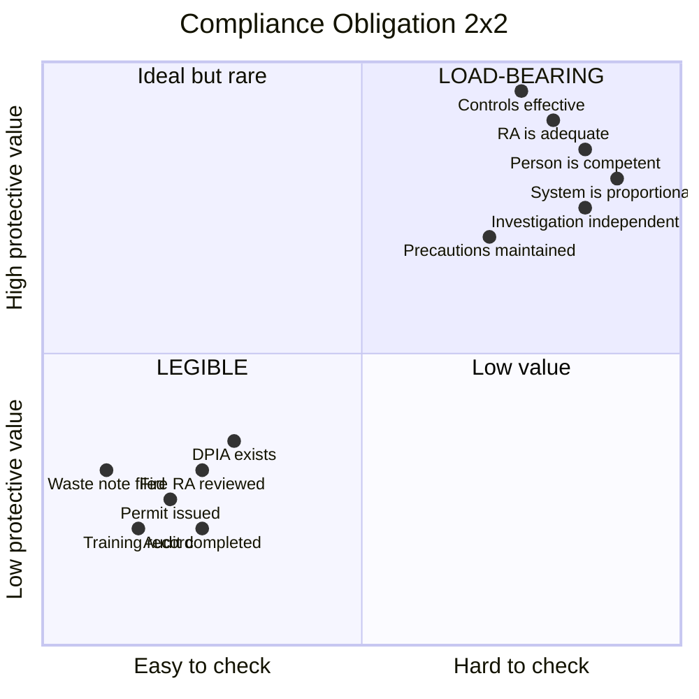
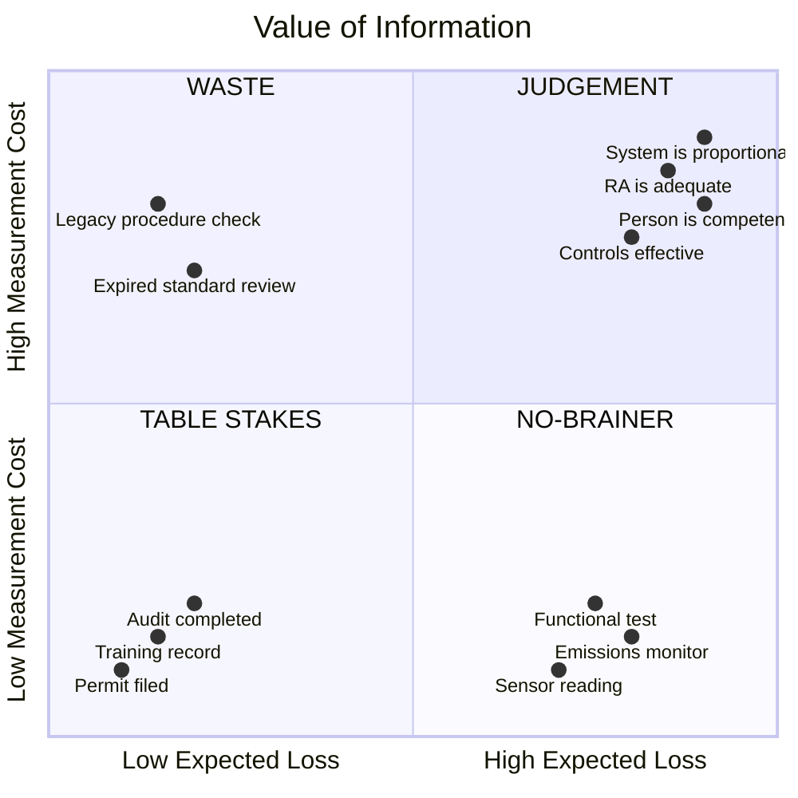
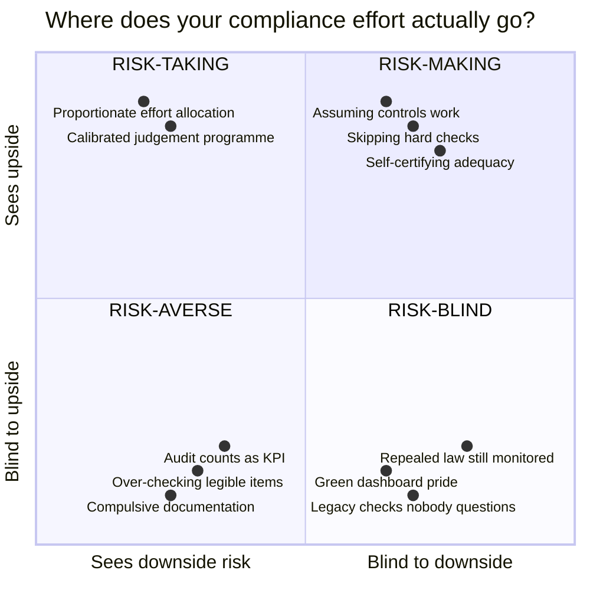

# Legible vs Load-Bearing

The distinction at the heart of the L4 Evidence tier: not all compliance evidence is equal, and the most important requirements are the hardest to evidence.

---

## The two properties

A legal obligation has two properties that tend to run in opposite directions:

- **Legible**: the obligation reduces cleanly to a checkable tick — countable, schedulable, unambiguous. *"The permit was issued." "The training record exists." "The assessment was reviewed on schedule." "The waste transfer note was filed."*

- **Load-bearing**: the obligation actually carries the weight of compliance — its failure is what exposes the organisation to regulatory action, prosecution, or harm. *"The risk assessment is actually adequate to the hazard." "The environmental management system is actually proportionate to the activity." "The person is actually competent to carry out the work." "The investigation was actually independent."*

The load-bearing obligations are the ones soaked in **judgement** — adequacy, competence, independence, sufficiency, proportionality. These are the words UK regulators use in enforcement: MHSWR 1999 requires a risk assessment that is "suitable and sufficient"; environmental permits require management systems "proportionate to complexity and risk"; the FCA demands "clear, traceable systems." These judgement terms are what make the obligations protective — and what makes them resist being turned into a tick.

---

## The operationalisation paradox

**A legal obligation is protective in proportion to the judgement it encodes, but checkable in inverse proportion to that judgement.**

A system that only checks the checkable — expiry dates, completion counts, existence of documents — automates what least needed automating and captures the important things only by replacing judgement with proxies. The proxy captures the *form* ("a risk assessment exists") while letting the *substance* slip away ("is this risk assessment actually adequate?").

| What's legible (easy to tick)                | What's load-bearing (actually protects)                                     |
| -------------------------------------------- | --------------------------------------------------------------------------- |
| "Risk assessment completed on time"          | *Is this risk assessment adequate to the actual hazard?*                    |
| "Environmental permit conditions documented" | *Is the management system proportionate to the complexity of the activity?* |
| "Training record complete, refresher done"   | *Can this person actually do this work competently?*                        |
| "Waste transfer notes filed"                 | *Is the waste classification actually correct?*                             |
| "Data protection impact assessment exists"   | *Does it actually identify and mitigate the privacy risks?*                 |
| "Fire risk assessment reviewed annually"     | *Are the identified fire precautions actually in place and maintained?*     |
| "Number of audits completed this quarter"    | *Did anyone act on what was found?*                                         |

Read down the right-hand column: every entry contains a word that resists a tick — *adequate, proportionate, competently, actually, correct*. That is the load-bearing judgement.

### The compliance 2x2

Plot any obligation on two axes — how *protective* it is (how much real compliance weight it carries) against how *checkable* it is (how easily a system can verify it). The paradox is the diagonal: obligations move from bottom-right to top-left. The most protective obligations are the least checkable.



**Bottom-left (LEGIBLE)**: Easy to check, low protective value. Your system handles these cheaply — automated expiry tracking, counts, status fields. Table stakes, not differentiators.

**Top-right (LOAD-BEARING)**: High protective value, hard to check. Where regulatory enforcement bites, where "suitable and sufficient" is tested in court. Needs a named person exercising calibrated judgement.

**Top-left (WIN-WIN)**: Easy to check *and* high protective value. Something the organisation does — once or ongoing — that makes both the upside (opportunity) and the downside (threat) better. An emissions monitor that proves permit compliance *and* optimises the process. A competence system that satisfies training obligations *and* builds real capability. An incident reporting culture that meets regulatory requirements *and* catches problems early. These aren't just "automated controls" — they're any practice where evidencing compliance and improving the business are the same act.

**Bottom-right (WASTE)**: Hard to check *and* low protective value. Legacy procedures nobody uses but nobody has reviewed. Compliance requirements from repealed legislation still being checked. Over-engineered documentation for low-risk activities. This is where compliance waste lives — and organisations spend more time here than they realise.

### From control properties to Expected Loss

The compliance 2x2 above describes obligations. The Controls ontology (L3) has three properties that determine how much you stand to lose by not checking a *specific control*:

| Control property | What it tells you | Low to High |
|-----------------|-------------------|-----------|
| **Info_Distance** | How far the control is from the person who needs assurance | Direct (observable) to Remote (can't see it) |
| **Time_Between_Touches** | How long since someone checked | Recently verified to Long since tested |
| **Blast_Radius** | How bad it is if the control has failed | Local (one process) to Enterprise (the whole organisation) |

The first two compute **uncertainty** — how confident are you that this control still works? The third computes **consequence** — how bad is it if you're wrong?

```
Expected Loss = Uncertainty x Consequence

Where:
  Uncertainty = f(Info_Distance, Time_Between_Touches)
  Consequence = Blast_Radius
```

A Remote, stale control with Enterprise blast radius has high expected loss. A Direct, fresh control with Local blast radius has low expected loss. This is a property of the *control*, not of the evidence decision.

### The VoI 2x2

Value of Information is a separate calculation that *uses* Expected Loss as one input and compares it to **Measurement Cost** — how much does it cost to check? (See [VALUE-OF-INFORMATION.md](VALUE-OF-INFORMATION.md) for the full framework.)

```
VoI = Expected Loss - Measurement Cost
```



**Bottom-left (TABLE STAKES)**: Low expected loss, cheap to measure. Type-A artefacts — permit filed, training record exists, audit completed. Automate and move on. Necessary for compliance hygiene but low VoI.

**Bottom-right (NO-BRAINER)**: High expected loss, cheap to measure. Type-B artefacts — sensor readings, functional test results, automated monitoring. The data discriminates and is cheap to collect. Just do it.

**Top-right (JUDGEMENT)**: High expected loss, expensive to measure. Load-bearing obligations — is the risk assessment adequate? Is the person competent? High VoI justifies the cost of a calibrated person's time.

**Top-left (WASTE)**: Low expected loss, expensive to measure. Legacy procedures, expired standard reviews. Negative VoI — the measurement costs more than the expected loss. Stop doing these.

### Why the previous model was wrong

An earlier version of this document tried to put four dimensions (Info_Distance, Time_Between_Touches, Measurement Cost, VoI) on a single 2x2 as if they correlated along one gradient. They don't:

- A control can be **Remote + Stale** (high uncertainty) but with **Local** blast radius (low consequence) giving low Expected Loss despite high uncertainty. Not worth expensive judgement.
- A control can be **Direct + Fresh** (low uncertainty) but with **Enterprise** blast radius (high consequence) giving moderate Expected Loss despite low uncertainty. Worth cheap monitoring.
- **Measurement Cost** is an *input* to VoI, not a parallel axis. You can't put them on opposite sides of the same square because one is a component of the other.

The correct separation: control properties compute Expected Loss (Step 1). VoI compares Expected Loss to Measurement Cost (Step 2). Two steps, not one gradient.

### Where the evidence types sit

| VoI quadrant | Evidence type | What to do |
|-------------|---------------|-----------|
| **TABLE STAKES** | Type-A artefacts (activity) | System watches. Automate. Don't count as work. |
| **NO-BRAINER** | Type-B artefacts (outcome) | System collects. High discriminating power, low cost. Essential. |
| **JUDGEMENT** | Judgement records | Calibrated person assesses. Expensive but VoI justifies it. Target here. |
| **WASTE** | Whatever you're currently doing here | Stop. Redirect effort to JUDGEMENT or NO-BRAINER. |

### The risk 2x2 overlay: where does your effort actually go?

The VoI 2x2 tells you where effort *should* go. The risk 2x2 tells you where it *actually* goes — and what that reveals about the organisation's posture:



| Risk posture | Evidence behaviour | VoI quadrant | The tell |
|---|---|---|---|
| **Risk-averse** | Compulsively checking TABLE STAKES because it's cheap and visible. Effort flows here because it *can*. | TABLE STAKES only | High completion rates. Green dashboards. Nobody asking "so what?" |
| **Risk-blind** | Not checking JUDGEMENT because it's hard to measure. Not questioning WASTE because nobody asks. | Empty JUDGEMENT quadrant | No judgement records. "Adequate" appears in zero compliance records. |
| **Risk-taking** | Skipping the expensive checks, self-certifying adequacy, assuming things work. | Claiming JUDGEMENT without doing the work | Self-assessment without basis. Judgement fields empty. |
| **Risk-making** | Investing effort where VoI is highest. Automating TABLE STAKES. Collecting NO-BRAINER data. Funding JUDGEMENT. Eliminating WASTE. | All quadrants appropriately resourced | Outcome data. Judgement records with basis. Compliance and operational value indistinguishable. |

**The diagnostic question**: take your compliance effort — person-hours, audit time, documentation burden — and plot where it lands on the VoI 2x2. If most effort is TABLE STAKES and the JUDGEMENT quadrant is empty, the organisation is **risk-averse about compliance**. It feels rigorous. It is not.

**The shift**:

- **TABLE STAKES** — automate, stop counting it as work
- **WASTE** — stop checking things that don't protect anyone
- **NO-BRAINER** — collect the cheap, discriminating data (Type-B artefacts)
- **JUDGEMENT** — put calibrated people here, fund the expensive measurement
- **WIN-WIN** — engineer practices where compliance and value creation are the same act

---

## Why this matters for evidence

The Evidence tier (L4) handles two kinds of things:

- **Artefacts** register things that exist — documents, logs, certificates, test results, sensor readings. The system watches these. They are signals to judgement, ranging from low-confidence (Type-A, a filed form) to high-confidence (Type-B, a functional test result that discriminates on its own).

- **Judgements** record acts performed — a named person assessed whether the obligation is *actually* met, recorded what they observed, what they found, and what the measurement method actually tells us now. Immutable. The audit object is the exercise of judgement over time, not a tick.

A register full of artefacts with no judgements has the legible boxes ticked and the load-bearing reality unwatched. This is not a hypothetical — it is the structural default of any compliance system that only counts documents.

---

## The trap it sets

Left unchecked, the paradox produces three failures:

1. **You measure what's measurable, and manage that.** Effort flows to legible metrics (% of assessments completed, documents filed on time) because those are what get reported and audited. Goodhart's Law: when a measure becomes a target, it stops being a good measure.

2. **The dashboard goes green on the trivial while the load-bearing goes unwatched.** Every obligation has an assessment, every control has an artefact, every date is met. But nobody has asked: *are these controls actually working? Is the risk assessment actually adequate? Is the person actually competent?*

3. **A complete green dashboard is the most dangerous state, not the most reassuring.** The more fully the legible boxes are ticked, the stronger the false sense of compliance — and the better-hidden the load-bearing gap. Green means "the things we can easily check are checking out." It does not mean "compliant."

---

## The way through

The resolution is not a cleverer metric. It is to handle the two kinds of obligation differently and honestly:

1. **For the legible ones, let the system watch them.** Expiry dates, counts, existence checks, automated logs — this is what the Artefacts table does well. Track Type-A (activity) and Type-B (outcome) artefacts.

2. **For the load-bearing ones, put a named, calibrated person on them.** Record their judgement in a Judgement record — who judged, what they observed (Basis), what they found (Finding: Still True / Drifted / Retired), and what the measurement method actually tells us now (Verified Meaning). The audit object is the exercise of judgement over time, not a tick.

3. **When judgement finds drift, use the three exits.** Correct the work (practice was wrong), amend the constraint (the obligation/control was wrong), or protect competent adaptation (the gap is healthy — the person adapted sensibly and the system must not "correct" that away).

4. **Surface what's missing, not just what's present.** Controls with no judgement record. Obligations with no mapped controls. Judgements that are stale relative to the control's risk profile. The standing question: *what load-bearing judgement is not on this board at all?*

---

## Across compliance domains

The paradox is not specific to safety. It recurs wherever legal obligations encode judgement:

| Domain                   | Legible proxy                     | Load-bearing reality                                    |
| ------------------------ | --------------------------------- | ------------------------------------------------------- |
| **Health & Safety**      | Risk assessment exists            | Risk assessment is *adequate* (MHSWR reg.3)             |
| **Environment**          | Permit conditions documented      | Management system is *proportionate* (EA guidance)      |
| **Fire Safety**          | Fire risk assessment reviewed     | Fire precautions are *maintained* (RRO Article 17)      |
| **Data Protection**      | DPIA completed                    | Privacy risks are *actually mitigated* (UK GDPR Art.35) |
| **Financial Regulation** | Compliance monitoring plan exists | Systems and controls are *effective* (FCA SYSC 6)       |
| **Employment**           | Contracts issued within 2 months  | Working conditions *actually comply* (ERA 1996 s.1)     |
| **Building Safety**      | Safety case submitted             | Building is *actually safe* (BSA 2022 s.84)             |

The same structure appears in every domain: the statute uses a judgement term (adequate, proportionate, effective, maintained) that the compliance system must either honestly assess or quietly replace with a proxy.

---

## Key concepts

**Metis / legibility** *(James C. Scott, "Seeing Like a State").* Metis is local, practical, tacit knowledge that makes real systems work. Legibility is rendering things standardised and countable to govern them — which can destroy the metis it measures. The compliance equivalent: turning "competent person" into "person who completed the e-learning module."

**Measurement Inversion** *(Doug Hubbard, "How to Measure Anything").* We tend to measure the variables with the least information value and ignore those with the most. The compliance equivalent: dashboards full of completion rates, empty of effectiveness data.

**Type-A vs Type-B indicators** *(Andrew Hopkins, "Failure to Learn").* Type-A measures activity ("was the check done?"). Type-B measures outcome ("did the control work when tested?"). Only Type-B tells you about compliance. The compliance equivalent: counting how many risk assessments were completed vs how many controls failed when tested.

**Calibration** *(Hubbard).* A person is calibrated when their stated confidence matches reality — and this is measurable and trainable. The mechanism that makes load-bearing judgement defensible: not a tick, but a named person's assessed conclusion with a track record of accuracy. See [EVIDENCE-CALIBRATION.md](EVIDENCE-CALIBRATION.md) for terminology.

---

## References

- Scott (1998) *Seeing Like a State* — legibility and metis
- Hubbard (2007) *How to Measure Anything* — Measurement Inversion, calibrated probability assessment, EVI
- Hopkins (2008) *Failure to Learn* — Type-A vs Type-B indicators
- Rae & Provan (2018) "Safety work versus the safety of work" — the visible performance vs the actual state
- Goodhart (1975) — "when a measure becomes a target, it ceases to be a good measure"
- MHSWR 1999 reg.3 — "suitable and sufficient" risk assessment
- EA Compliance Classification Scheme — "proportionate" management systems
- FCA SYSC 6 — "effective" compliance systems and controls
- Regulatory Reform (Fire Safety) Order 2005 Art.17 — fire precautions "maintained"
- UK GDPR Art.35 — data protection impact assessment
- Building Safety Act 2022 s.84 — safety case for higher-risk buildings
- `EVIDENCE-SCHEMA.md` — canonical L4 entity model (Artefacts, Judgements, Gaps)
- `EVIDENCE-CALIBRATION.md` — judgement vs calibration vs drift terminology
- `VALUE-OF-INFORMATION.md` — EVI, the discriminating test, VoI framework
- `DEFINITION-OF-EVIDENCE.md` — evidence as information that changes rational credence
