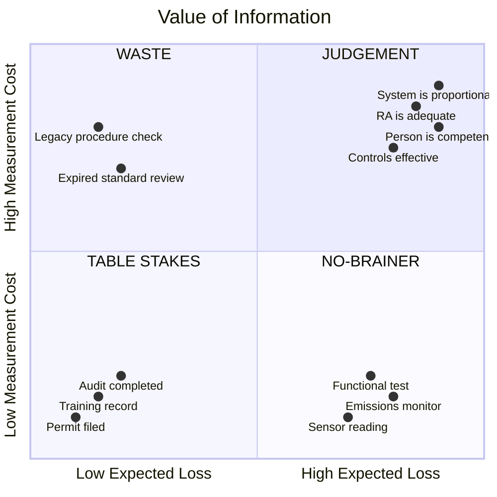

# Value of Information

> **How much is it worth to know something before making a decision?**

The Value of Information (VoI) is not the value of the information itself. It is the value of **the improved decisions that the information enables**. A perfectly accurate report about something irrelevant has zero value. A rough estimate about something that changes a million-pound decision can be enormously valuable.

This distinction drives everything in the L4 Evidence tier: not all evidence is equally worth collecting, and the compliance industry's instinct to collect everything is exactly backward.

---

## The intuition

Imagine you have to decide whether to inspect a pressure vessel.

- Inspection costs **£10,000**
- Failure would cost **£5 million**
- Current evidence suggests failure probability is **0.1%**

Without additional information, the expected loss is:
> 0.001 x £5,000,000 = **£5,000**

Since inspection costs £10,000, you probably wouldn't inspect.

Now suppose a sensor reading can tell you whether corrosion is actually present. If the sensor is accurate, you would inspect only when corrosion is detected. The **value of that sensor** is the reduction in expected costs compared with your current decision.

---

## Formal definition

Decision theory defines VoI as:

> Expected utility **with** the information - Expected utility **without** the information - Cost of obtaining the information

Or equivalently: the **reduction in expected loss**.

Information has value only if it changes what you do.

---

## The three conditions (Hubbard)

> Information has value only when three conditions hold simultaneously:
> 1. There is **uncertainty** (you don't already know)
> 2. There is a **decision** to make (something depends on the answer)
> 3. The consequences of a **wrong decision** are material (being wrong matters)
>
> Remove any one condition and Value of Information drops to zero.
>
> — adapted from Doug Hubbard, *How to Measure Anything* (2007)

### When VoI is zero

Suppose you're deciding whether to wear a hard hat inside an operational workshop. Regardless of whether tomorrow's weather is sunny or rainy, you still wear the hard hat. The weather forecast provides information — but it doesn't change the decision. **VoI = 0.**

This is surprisingly common in compliance. Evidence collected for obligations where the organisation would take exactly the same action whether compliant or not has zero VoI. A compliance system that collects evidence everywhere — every obligation, every control, every period — is ignoring this. It treats all evidence as equally valuable, spending the same effort on a permit filing (low uncertainty, low consequence) as on whether a critical control actually works (high uncertainty, high consequence).

---

## Two kinds of VoI

### Value of Perfect Information (VPI)

An oracle tells you the true state of the world before you decide. Will this component fail? Yes → replace it. No → leave it. The improvement over your current uncertainty is the **VPI** — the maximum anyone should ever pay for information about this question.

### Value of Imperfect Information (VII)

Real information is noisy: inspections, audits, AI classifiers, sensors, witness reports, expert judgement. These reduce uncertainty but don't eliminate it. Their value depends on accuracy, precision, false positive rate, and false negative rate. An expensive but inaccurate inspection may have lower value than a cheaper, moderately accurate one.

In compliance terms: a calibrated person with a 90% track record of accuracy provides higher VII than an uncalibrated person with unknown accuracy, even if the uncalibrated person spends more time. This is why the Personnel table carries `calibration_score` — it encodes the quality of the information source.

---

## The four ingredients

VoI depends on four things:

| Ingredient | Low VoI | High VoI |
|-----------|---------|----------|
| **1. Uncertainty** | You already know the answer | You genuinely don't know |
| **2. Decision alternatives** | No choices — the action is fixed regardless | Multiple choices that depend on the answer |
| **3. Consequences** | Small — a £20 office chair | Large — a £5M process failure, a prosecution, harm |
| **4. Ability to act** | You can't change anything even with the information | You can change course based on what you learn |

Even perfect knowledge is worthless if you cannot change anything. A storm discovered after takeoff with no diversion possible: VoI = 0.

---

## The Measurement Inversion

> We tend to measure the variables with the least information value and ignore those with the most.
> — Doug Hubbard

Compliance practice systematically inverts VoI:

| What gets measured (low VoI) | What doesn't get measured (high VoI) |
|-----|------|
| % of risk assessments completed on time | Whether any risk assessment is actually adequate |
| Number of training records filed | Whether anyone can actually do the job safely |
| Audit completion rate | Whether audits found anything and anyone acted on it |
| Number of documents in the evidence vault | Whether any document discriminates between "compliant" and "not compliant" |

The inversion happens because low-VoI measurements are **cheap, legible, and satisfying**. They produce green dashboards and high completion rates. High-VoI measurements are **expensive, judgement-laden, and sometimes produce bad news**. Organisations avoid them for the same reason people avoid medical tests they suspect will show something wrong.

---

## The discriminating test

A practical VoI check for any piece of evidence:

> **Would this evidence look different if the obligation were met vs not met?**

If yes — the evidence **discriminates**. It has a high likelihood ratio. It is worth collecting.

If no — the evidence would exist regardless. A filed risk assessment that would be filed whether or not the controls work. A training record that would exist whether or not the person is competent. These have a likelihood ratio near 1 and near-zero evidential value for the compliance question.

| Evidence | Discriminates? | VoI |
|----------|---------------|-----|
| Backup log showing success/failure | Yes — different if backup failed | High |
| Filed risk assessment | No — filed regardless of adequacy | Low |
| Functional test result (pass/fail) | Yes — different if control failed | High |
| Training completion certificate | Partially — proves attendance, not competence | Medium |
| Calibration finding (Still True / Drifted) | Yes — directly discriminates | Highest |
| Audit completion date | No — audit happened regardless of findings | Low |
| Audit *findings and actions taken* | Yes — different if problems found | High |

The pattern: **outcome evidence discriminates, activity evidence doesn't.** Type-B evidence (Hopkins) has high VoI. Type-A evidence has low VoI.

---

## Bayesian connection

VoI naturally fits Bayesian reasoning. You begin with a prior belief:

```
P(Control effective) = 95%
```

You perform a calibration. New evidence updates the probability:

```
P(Control effective | calibration finding) = 60%
```

The updated belief changes your decision — from "continue as-is" to "investigate and correct." The value of the calibration was the improvement in the decision. Without it, you would have left a failing control in place with 95% false confidence.

---

## VoI as a 2x2

VoI is a comparison of two things: **Expected Loss** (what you stand to lose by not checking) and **Measurement Cost** (what it costs to check). These are the two axes. See [LEGIBLE-vs-LOAD-BEARING.md](LEGIBLE-vs-LOAD-BEARING.md) for how control properties compute Expected Loss.

```
Expected Loss = Uncertainty x Consequence

Where:
  Uncertainty = f(Info_Distance, Time_Between_Touches)  -- from Controls ontology
  Consequence = Blast_Radius                            -- from Controls ontology

VoI = Expected Loss - Measurement Cost
```



| VoI quadrant | Evidence type | Action |
|-------------|---------------|--------|
| **TABLE STAKES** (low loss, cheap) | Type-A artefacts | Automate. Don't count as work. |
| **NO-BRAINER** (high loss, cheap) | Type-B artefacts | Collect. High discriminating power, low cost. |
| **JUDGEMENT** (high loss, expensive) | Judgement records | Fund calibrated people. VoI justifies the cost. |
| **WASTE** (low loss, expensive) | Legacy checks | Stop. Redirect effort. |

The calibration regime uses this directly:

---

## VoI in the calibration regime

The calibration regime is VoI targeting in operation:

- **High priority** (high blast radius, high uncertainty) → short drift_interval → calibrate often → high VoI, worth the expense
- **Low priority** (low blast radius, low uncertainty) → long drift_interval → calibrate rarely → low VoI, let the system watch

The fractalaw edge AI computes priority from control properties, emits observation signals (`control.stale`, `control.no_calibration`), and the compliance officer's judgement is directed where VoI is highest — not spread evenly, not on a calendar, but targeted by expected value.

---

## VoI and AI

VoI is becoming central to AI systems because AI often exists to improve decisions rather than simply produce predictions.

- An AI model flags contracts likely to contain regulatory obligations
- An AI system classifies maintenance records for emerging hazards
- An AI assistant recommends whether additional evidence is needed before closing a compliance action
- fractalaw edge apps scan control properties and emit signals where VoI is highest

A model with slightly higher predictive accuracy is not necessarily more valuable if it rarely changes decisions. Conversely, a model that selectively requests additional evidence only when uncertainty is high can deliver substantial value by reducing costly mistakes while avoiding unnecessary work.

---

## Implications for the compliance system

1. **Don't collect evidence uniformly.** Target evidence effort at high-VoI obligations — remote, stale, high blast radius, judgement-laden. Automate the rest.

2. **Prefer discriminating evidence.** Functional test results over completion certificates. Calibration findings over filed documents. Outcome data over activity data.

3. **Let fractalaw compute VoI.** The control properties (Info_Distance, Last_Verified, Blast_Radius) encode the inputs. fractalaw emits observation signals where VoI is highest. The compliance officer's time follows the signal.

4. **A green dashboard with low-VoI evidence is not assurance.** It means "the things we can cheaply check are checking out." It says nothing about the obligations where P(wrong) x Cost(wrong) is highest.

5. **The calibration regime IS the VoI allocation mechanism.** drift_interval derived from control properties is VoI targeting in operation. Scarce calibrated judgement goes where it reduces the most expected loss.

---

## A concise definition

> **The Value of Information is the expected improvement in decision quality that results from obtaining additional information, measured as the reduction in expected loss after accounting for the cost of acquiring that information.**

This shifts compliance from collecting more evidence to collecting the **right** evidence — the evidence most likely to improve consequential decisions.

---

## References

- Hubbard (2007) *How to Measure Anything* — measurement as uncertainty reduction, EVI, the Measurement Inversion, calibrated probability assessment
- Shannon (1948) *A Mathematical Theory of Communication* — information as uncertainty reduction
- Hopkins (2008) *Failure to Learn* — Type-A vs Type-B indicators, the BP Texas City case
- ISA 500 (IAASB) — sufficiency and appropriateness as quality dimensions of evidence
- Raiffa (1968) *Decision Analysis* — Expected Value of Perfect/Imperfect Information
- `DEFINITION-OF-EVIDENCE.md` — what evidence is
- `LEGIBLE-vs-LOAD-BEARING.md` — the operationalisation paradox, the evidence demand gradient
- `EVIDENCE-SCHEMA.md` — canonical L4 entity model (Evidence_Class: Activity / Outcome)
