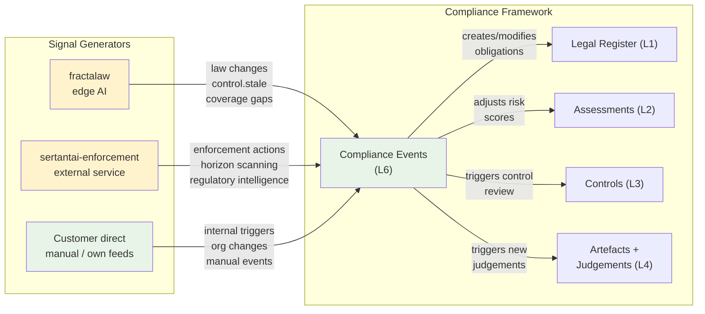

# L6 Events & Change Intelligence — Schema

The canonical entity model for L6. Events are logged, triaged, assessed for impact, and tracked through the compliance response. The Events log provides **provenance** — every change to the compliance register traces back to the event that triggered it.

---

## Architecture: three signal sources



| Source | What it provides | Status |
|--------|-----------------|--------|
| **fractalaw** (edge AI) | Legislative change detection (ChangeDetector), control observations (control.stale, control.no_calibration), coverage gap signals | Built (change detection), planned (observations — see evidence-calibration-tier session) |
| **sertantai-enforcement** (external service) | HSE prosecution/notice data, EA enforcement actions, regulatory horizon scanning, peer enforcement intelligence | Planned |
| **Customer direct** | Manual event entry, own RSS/webhook feeds, internal triggers (org changes, audit findings, whistleblowing) | Via Baserow/CAT — customer configures their own inputs |

The compliance framework is **source-agnostic**. An event has a `signal_source` and `signal_ref` for traceability, but the schema doesn't care where the signal came from. fractalaw, sertantai-enforcement, and customer direct feeds all produce events with the same schema.

---

## Entity: Compliance Events

One row per event detected. Tracks the full lifecycle from detection through response to close-out.

### Fields

| Field | Type | Nullable | Constraints | Description |
|-------|------|----------|-------------|-------------|
| `id` | uuid | no | PK | |
| `title` | text | no | | Short description of the event |
| `event_type` | enum | no | See values | Classification of the event |
| `event_source` | enum | no | See values | External regulatory / enforcement / reputational / internal operational / internal organisational |
| `signal_source` | enum | yes | See values | Which system generated this signal |
| `signal_ref` | text | yes | | External reference for traceability (fractalaw change ID, HSE notice number, SI number, etc.) |
| `date_detected` | date | no | | When the signal was received |
| `date_effective` | date | yes | | When the event takes effect (commencement date for legislation, notice date for enforcement) |
| `date_closed` | date | yes | | When the response was completed |
| `urgency` | enum | no | See values | How quickly a response is needed |
| `triage_status` | enum | no | See values | Material / Monitor / Not Applicable |
| `triage_rationale` | text | yes | | Why this triage decision was made. Required for Not Applicable. |
| `description` | text | yes | | Full description of the event and its context |
| `impact_summary` | text | yes | | What parts of the compliance register are affected and how |
| `response_status` | enum | no | See values | Lifecycle state of the response |
| `owner_id` | uuid | yes | FK → personnel | Who owns the response to this event |
| `notes` | text | yes | | |
| `inserted_at` | timestamp | no | auto | |
| `updated_at` | timestamp | no | auto | |

### Link fields (impact mapping)

| Field | Type | Nullable | Description |
|-------|------|----------|-------------|
| `affected_laws` | uuid[] | yes | FK → lrt (Legal Register). Which laws are affected by this event. |
| `affected_controls` | uuid[] | yes | FK → controls. Which controls need review because of this event. |
| `affected_assessments` | uuid[] | yes | FK → assessments. Which assessments need re-evaluation. |
| `related_artefact_id` | uuid | yes | FK → artefacts. If this event produced an artefact (e.g. enforcement notice as a document). |

### Enums

```
event_type:
  Regulatory Change        -- new/amended/repealed legislation, new guidance, consultation
  Enforcement Action       -- prosecution, notice, fine (against self or peer)
  Permit Change            -- new/amended/revoked permit condition
  Reputational             -- media coverage, sector incident, NGO campaign
  Internal Control Failure -- control failure discovered through L4/L5
  Internal Organisational  -- new site, new process, M&A, restructure, personnel change
  Audit Finding            -- L5 assurance finding that triggers reassessment
  Whistleblowing           -- protected disclosure requiring investigation

event_source:
  External Regulatory      -- from a regulator or legislative body
  External Enforcement     -- from regulator enforcement activity
  External Reputational    -- from media, industry bodies, public domain
  Internal Operational     -- from within the organisation's operations
  Internal Organisational  -- from corporate/structural changes

signal_source:
  fractalaw               -- fractalaw change detection or edge AI observation
  sertantai-enforcement   -- sertantai enforcement intelligence service
  Customer Feed           -- customer's own RSS/webhook/manual entry
  Manual Entry            -- person entered directly
  Regulator Direct        -- received directly from regulator (notice, letter)

urgency:
  Immediate               -- enforcement notice, prohibition — respond in days
  Scheduled               -- new law commences on a date — prepare by then
  Monitoring              -- consultation open, Bill progressing — watch and influence
  Background              -- sector trend, political signal — factor into planning

triage_status:
  Material                -- triggers downstream work (impact assessment, obligation update)
  Monitor                 -- logged, tracked, no immediate action
  Not Applicable          -- dismissed with rationale recorded

response_status:
  Detected                -- signal received, not yet triaged
  Triaged                 -- triage decision made
  Assessing Impact        -- determining which obligations/controls are affected
  Responding              -- compliance register being updated, controls being reviewed
  Closed                  -- all downstream work complete, event record closed
```

### Lifecycle

```
Detected → Triaged → Assessing Impact → Responding → Closed
```

1. **Detected**: signal arrives. Logged with source, type, dates. `response_status = Detected`.
2. **Triaged**: assessed for applicability and materiality. `triage_status` set. `response_status = Triaged`. Not Applicable events can be closed immediately.
3. **Assessing Impact**: for Material events — mapping to affected obligations, controls, assessments. `impact_summary` populated. Link fields populated. `response_status = Assessing Impact`.
4. **Responding**: downstream work in progress — obligations updated (L1), risk scores adjusted (L2), controls reviewed (L3), new judgements triggered (L4). `response_status = Responding`.
5. **Closed**: all downstream work verified complete. `date_closed` set. `response_status = Closed`.

Monitor events stay at `Triaged` until they become Material (e.g. a consultation becomes enacted legislation) or are closed as no-longer-relevant.

### Relationships

| Relationship | Cardinality | Description |
|-------------|-------------|-------------|
| Event → Legal Register | many:many | Which laws are affected |
| Event → Controls | many:many | Which controls need review |
| Event → Assessments | many:many | Which assessments need re-evaluation |
| Event → Artefact | many:1 | If the event produced a document (enforcement notice, consultation response) |
| Event → Personnel (owner) | many:1 | Who owns the response |

---

## How events relate to the Legal Register

The Legal Register (L1) captures the **current state** of applicable laws. The Events log captures **what changed and when**.

| | Legal Register (L1) | Events (L6) |
|---|---|---|
| **Records** | Laws, duties, actors — as they stand now | The change events that caused the register to update |
| **Answers** | "What are our obligations?" | "Why did this obligation change?" / "When did we find out?" |
| **Lifecycle** | Updated in place (duty text changes, status changes) | Immutable event records — the log of what happened |
| **Example** | HSWA 1974 s.2 — current text, current status | "SI 2026/123 amended HSWA s.2, detected 2026-03-10, commenced 2026-04-01, response closed 2026-04-15" |

A Regulatory Change event links to the affected law(s) in the Legal Register via `affected_laws`. The event record persists as provenance even after the Legal Register has been updated. This means you can always answer: "when did we become aware of this change?" and "how long did it take us to respond?"

**fractalaw's role**: fractalaw's ChangeDetector already detects legislative changes and publishes them via Zenoh. These signals should create L6 event records automatically — one Compliance Event per detected change, with `signal_source = fractalaw` and `signal_ref` pointing to the change detection ID. The event then follows the lifecycle (triage → impact assessment → response → close-out) while fractalaw separately updates the LRT data.

### LRT fields as event signal sources

The `uk_lrt` resource in sertantai-legal already tracks rich change data that is not exposed in the Baserow projection but is available as a source for automatic event generation:

| LRT field(s) | What it tells you | Event type it generates |
|-------------|-------------------|----------------------|
| `live`, `live_description`, `live_from_changes` | Law status: in force / repealed / revoked / spent | Status change → Regulatory Change event |
| `amending`, `amended_by` | Amendment relationships — which laws this law amends, which laws amend it | Amendment detected → Regulatory Change event |
| `is_amending`, `is_rescinding`, `is_enacting`, `is_making`, `is_commencing` | Functional classification — what this law *does* to other laws | New amending/rescinding SI → Regulatory Change event for each affected law |
| `amending_change_log`, `amended_by_change_log` | Text log of amendment relationship changes | Change log entry → event with `signal_ref` pointing to the change |
| `record_change_log` | Structured log of all changes to the LRT record (field-level diffs) | Any material field change → event |
| `latest_amend_date`, `latest_change_date`, `latest_rescind_date` | Most recent dates for amendments, changes, rescissions | Date change → detectable trigger for event generation |
| `md_coming_into_force_date`, `md_enactment_date`, `md_made_date` | Statutory dates — when the law was made, enacted, commenced | Commencement approaching → Scheduled urgency event |
| `making_classification`, `making_confidence` | fractalaw's classification of whether this law creates obligations | Classification change → potential new obligations event |

**Amendment Annotations** (`amendment_annotation` resource) provide section-level change detail:

| Field | What it tells you | Event detail |
|-------|-------------------|-------------|
| `code` | The amendment identifier | Maps to `signal_ref` on the event |
| `code_type` | Type of amendment (substitution, insertion, repeal, etc.) | Maps to event description — "Section 3 substituted by SI 2026/456" |
| `affected_sections` | Which sections of the target law are changed | Maps to `impact_summary` — pinpoints affected provisions → affected duties (L1) |

This data means event generation for legislative change is not guesswork — the amendment graph already tracks exactly which laws amend which other laws, at which sections, with what type of change. A fractalaw edge app can walk the graph and generate precise Compliance Events with pre-populated impact mapping:

```
Amendment detected (AmendmentAnnotation created)
    → "SI 2026/456 amends HSWA 1974 s.3(1) — substitution"
    → Compliance Event created:
        event_type: Regulatory Change
        signal_source: fractalaw
        signal_ref: amendment_annotation.id
        affected_laws: [HSWA 1974]
        impact_summary: "Section 3(1) substituted — review duties derived from this section"
        urgency: Scheduled (if commencement date known) or Monitoring (if not yet commenced)
```

This closes the loop between the LRT's structured change data and the L6 Events log — automated, precise, and traceable.

---

## How events relate to other layers

An event, once triaged as Material and impact-assessed, produces **downstream work** across the compliance framework:

| Layer | What the event triggers | Traceability |
|-------|------------------------|-------------|
| **L1 Obligations** | New/modified/removed duties in the Legal Register | `affected_laws` on the event links to the laws that changed |
| **L2 Risk** | Risk score adjustment (enforcement activity increases likelihood) | Assessment re-triggered, linked back to event |
| **L3 Controls** | Control review — are existing controls adequate for changed obligations? | `affected_controls` on the event |
| **L4 Evidence** | New judgements triggered for affected controls | Judgement basis references the event |
| **L5 Assurance** | Assurance function notified — may re-scope audit programme | Event surfaced in assurance planning queries |
| **L7 Governance** | Significant events (Limited/No Assurance, enforcement against self) escalated | Event urgency = Immediate triggers escalation |

The event record is the **provenance anchor**. Every downstream change references back to it.

---

## Baserow projection

| Canonical concept | Baserow adaptation |
|-------------------|-------------------|
| `affected_laws` (uuid[]) | link_row → Legal Register (many:many) |
| `affected_controls` (uuid[]) | link_row → Controls (many:many) |
| `affected_assessments` (uuid[]) | link_row → Assessments (many:many) |
| `related_artefact_id` | link_row → Artefacts |
| `owner_id` | link_row → Personnel (people sub-pattern) |
| Enums | single_select fields |
| Lifecycle enforcement | convention (documented in template moduledoc) |

### Views

| View | Type | Purpose |
|------|------|---------|
| All Events | Grid | Default — all events |
| Open Events | Grid | Filtered: response_status != Closed |
| Material Events | Grid | Filtered: triage_status = Material |
| By Type | Grid | Grouped by event_type |
| By Urgency | Kanban | Stacked by urgency |
| Event Board | Kanban | Stacked by response_status (lifecycle) |
| Monitoring | Grid | Filtered: triage_status = Monitor |

### Customer direct feeds

Customers using Baserow can create events manually (form view) or through Baserow's webhook/API capabilities. Customers using CAT can configure their own event feeds — RSS ingestion, email parsing, webhook receivers — that create Compliance Event records through the standard schema.

The schema is the same regardless of source. A manually-entered event has `signal_source = Manual Entry`. A fractalaw-generated event has `signal_source = fractalaw`. The compliance response is identical.

---

## What L6 is NOT (repeated for clarity)

- **Not a horizon scanning service.** fractalaw and sertantai-enforcement generate signals. L6 receives them.
- **Not an enforcement database.** HSE/EA/FCA maintain those. L6 logs enforcement events that affect this organisation.
- **Not a safety incident register.** Safety events serve ALARP and hazard logs. L6 handles compliance events.
- **Not a media monitoring service.** Reputational monitoring is a separate capability. L6 receives reputational signals.

---

## References

- `EVENTS-PATTERNS.md` — event classification, lifecycle, leading vs lagging intelligence
- `ASSURANCE-INTERFACE.md` — L5 seam pattern (L6 follows the same architecture for signal receipt)
- `EVIDENCE-SCHEMA.md` — Artefacts (events may produce artefacts), Judgements (events trigger new judgements)
- `COMPLIANCE-7-LAYERS.md` — L6 definition: detect and respond to triggers
- fractalaw ChangeDetector/ChangeNotifier — existing legislative change detection
